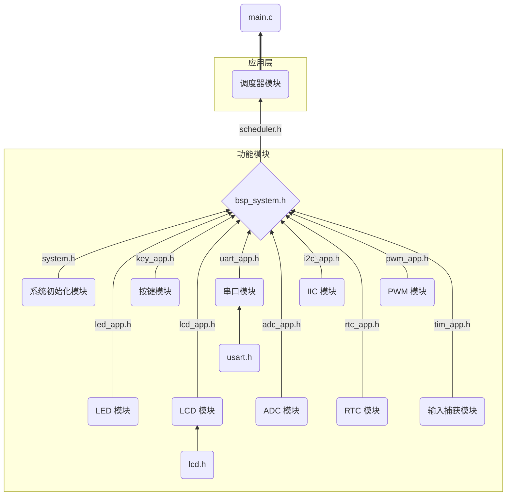
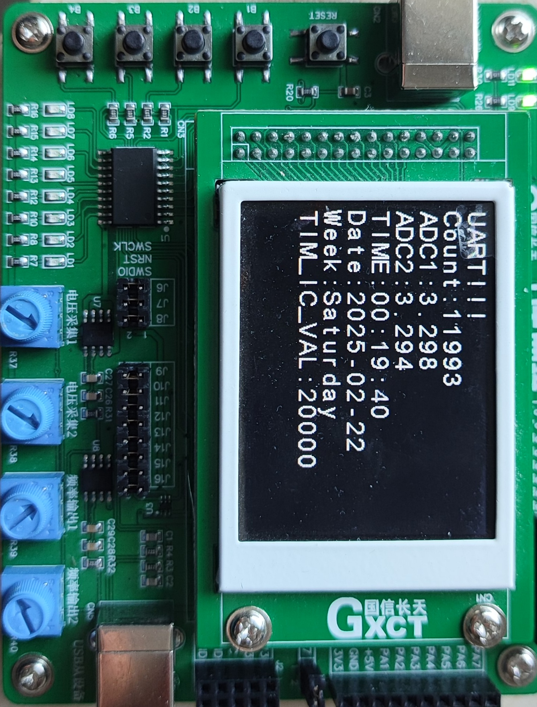
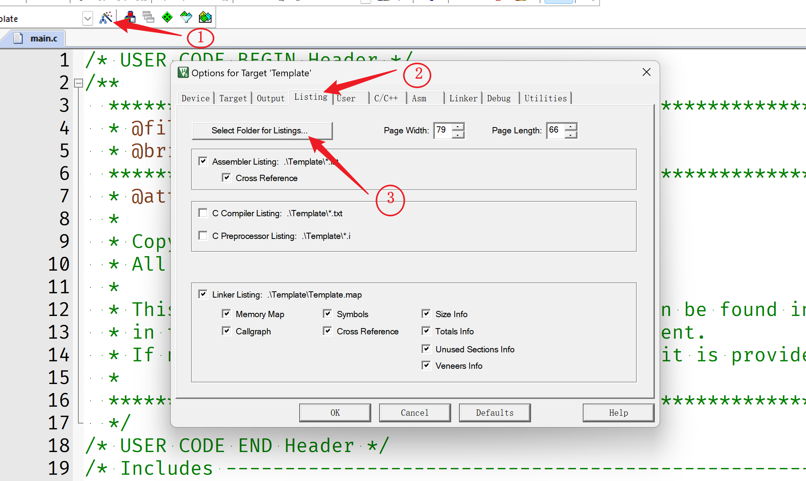
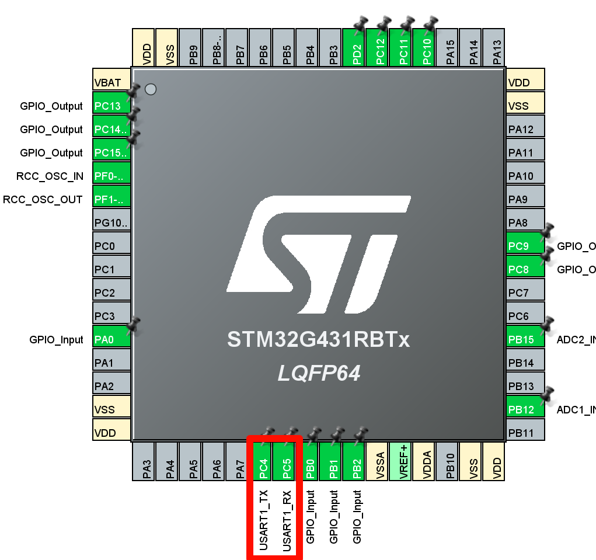
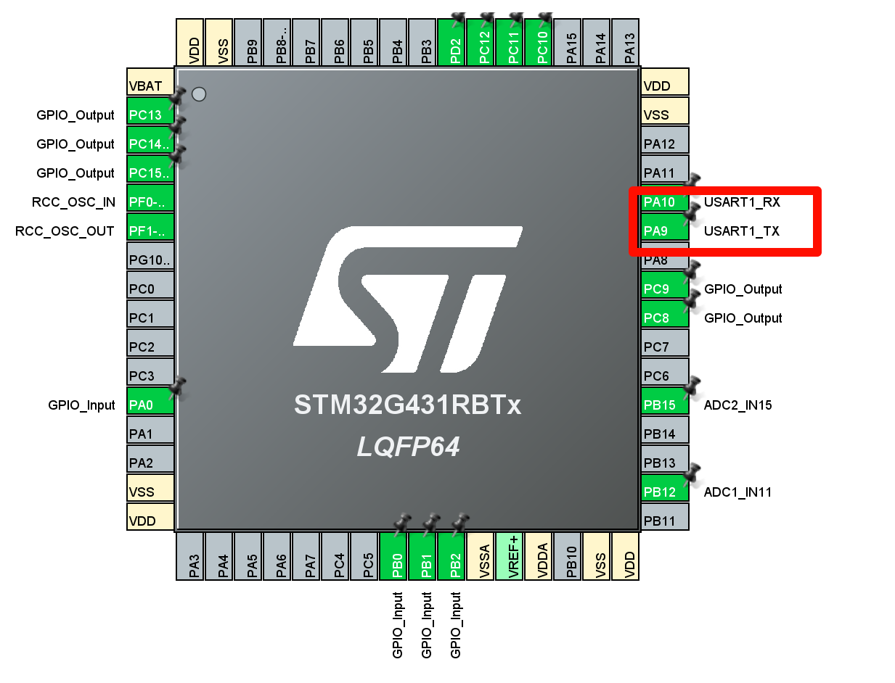

# 工程文档

## 简介

该模板主要包含了几个模块：

1. 静态调度器模块
2. LED 模块
3. 按键模块
4. LCD 模块
5. 串口模块（包含 DMA）
6. ADC 模块（包含 DMA）
7. IIC 模块
8. RTC 模块
9. PWM 模块
10. 输入捕获模块

## 框架结构图

## 资源及引脚分配

## 模板效果展示

## 注意事项

### 一、工程

#### 1. 如何解决使用 CubeMX 生成的工程在 Keil 中双击工程名无法打开.map 的问题？

- **问题的原因：** 使用 CubeMX 生成的 Keil 工程，生成 map 文件的路径不在工程文件夹下。

- **解决方法：**

    1. 在 keil 中点击 **魔术棒**，然后选择 `Listing`，找到下面的第一个按钮 `Select Folder for Listings...` 按钮，将路径设置在工程文件的目录下面

        

    2. 然后重新编译工程
    3. 最后双击工程名即可打开 `.map` 文件

#### 2. 如何解决使用串口无法打印输出的问题？

- **问题的原因：**
  1. 可能是使用 CubeMX 配置引脚的时候没有正确配置，比如说我就是将串口的引脚配置成 PC4 和 PC5，原理图上是 PA9 和 PA10 两个引脚（因为但是看的时候同样可以打开串口，所有就没有排错的时候就没有注意这个问题，最后将 UART 配置文件完全比对后才发现这个问题，费了我几天的时间查错，有点不值当）
     
  2. 可能是没有将中断使能函数放在初始化中
  3. 如果接受没有问题，出现程序卡死、打印混乱等问题，检查重定向的函数是否为 `int fputc` 以及是否开启  `MircoLIB`

- **解决方法：**
  1. 查看引脚时候配置正确
     
  2. 检查中断使能函数并放置在初始化，同时还有有一句放在外面使能了接收，后续接收才能自己循环开启接收
  3. 检查重定向的函数是否为 `int fputc` 以及是否开启  `MircoLIB`
