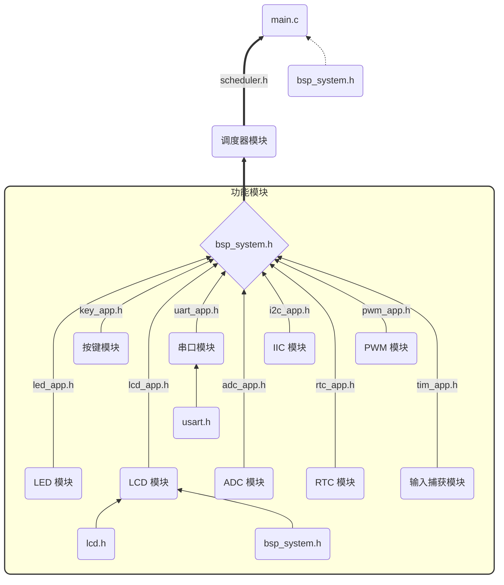

# 工程文档

## 简介

该模板主要包含了几个模块：

1. 静态调度器模块 
2. LED 模块
3. 按键模块
4. LCD 模块
5. 串口模块 (包含 DMA)
6. ADC 模块（包含 DMA）
7. IIC 模块
8. RTC 模块
9.  PWM 模块
10. 输入捕获模块

## 框架结构图

## 资源及引脚分配

## 实现内容

## 注意事项

### 一、工程

#### 1. 如何解决使用CubeMX生成的工程在Keil中双击工程名无法打开.map的问题？

- **问题的原因：** 使用CubeMX生成的Keil工程，生成map文件的路径不在工程文件夹下。

- **解决方法：**

    1. 在 keil 中点击**魔术棒**，然后选择`Listing`，找到下面的第一个按钮`Select Folder for Listings...`按钮，将路径设置在工程文件的目录下面

        

    2. 然后重新编译工程
    3. 最后双击工程名即可打开`.map`文件

#### 2. 如何
