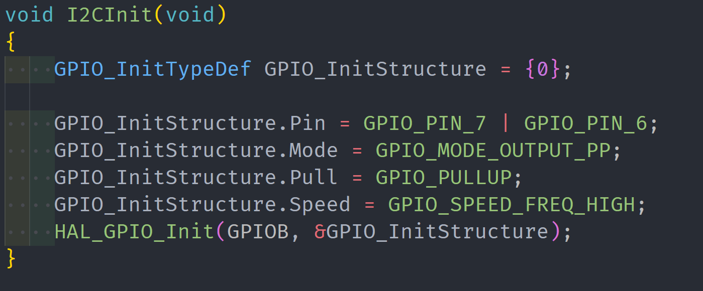

# 工程文档

> 说明：考试中没有 vscode 开发环境，还是要尽快适应 keil 的开发

## 简介

该模板主要包含了几个模块：

1. 静态调度器模块
2. LED 模块
3. 按键模块
4. LCD 模块
5. 串口模块（包含 DMA）
6. ADC 模块（包含 DMA）
7. IIC 模块
8. RTC 模块
9. PWM 模块
10. 输入捕获模块

## 框架结构图


## 引脚配置


## 时钟配置


## CubeMX 工程配置


## Keil 配置(可选)


## 模板最终效果展示


## 模块配置说明

> 以下是部分模块配置方法

1. 配置多通道测量占空比
    
2. ADC 多通道采集（同一个ADC控制器采集两个通道，注意数据传到buffer里面是交替的，做滤波的是否记得要分开）
    

## 注意事项

> 以下是一些常见的问题和解决方法

### 一、工程

#### 1. 如何解决使用 CubeMX 生成的工程在 Keil 中双击工程名无法打开.map 的问题？

- **问题的原因：** 使用 CubeMX 生成的 Keil 工程，生成 map 文件的路径不在工程文件夹下。

- **解决方法：**

    1. 在 keil 中点击 **魔术棒**，然后选择 `Listing`，找到下面的第一个按钮 `Select Folder for Listings...` 按钮，将路径设置在工程文件的目录下面

        

    2. 然后重新编译工程
    3. 最后双击工程名即可打开 `.map` 文件

### 二、模块

#### 1. LED 无法点亮？

- **问题的原因：**
    1. 可能是 PD2 未初始化

- **解决方法：**
    1. 检查 PD2 引脚是否初始化

#### 2. 按键按下没反应？

- **问题的原因：**
  1. 可能是 CubeMX 初始化没有点引脚
  2. 可能是调度器没有创建任务
  3. 可能底层写错了

- **解决方法：**
  1. 检查引脚时候配置正确
  2. 检查调度器是否创建了任务
  3. 检查底层代码是否正确

#### 3. LCD 屏幕黑屏和卡死问题？

- **问题的原因：**
**黑屏：**
  1. PD2 引脚未使能
  2. 晶振未配置合理
  3. MircoLIB 未勾选  
**卡死：**
  4. 调度器中的结构体的类型为 `uint32_t`？
    
  5. `lcd_sprintf`函数中的重装载内容过长？

- **解决方法：**
  1. 检查 PD2 引脚是否使能
  2. 检查晶振时钟是否配置合理
  3. 检查 MircoLIB 是否勾选
  4. 检查调度器中的结构体的类型是否为 `uint32_t`
  5. 尽量少使用隐式转换，比如 `printf`、`sprintf`这种函数的时候，类似于使用 `Lcd_Sprintf(Line5, "v:%2f", v_value)`这个函数段，`v_value`是一个整型，但是要显示的是浮点型，此时缓存区会出现溢出问题

#### 4. 如何解决使用串口无法打印输出的问题？

- **问题的原因：**
  1. 可能是使用 CubeMX 配置引脚的时候没有正确配置，比如说我就是将串口的引脚配置成 PC4 和 PC5，原理图上是 PA9 和 PA10 两个引脚（因为但是看的时候同样可以打开串口，所有就没有排错的时候就没有注意这个问题，最后将 UART 配置文件完全比对后才发现这个问题，费了我老半天查错，有点不值当）
     
  2. 可能是没有中断使能函数初始化
  3. 如果接受没有问题，出现程序卡死、打印混乱等问题，检查重定向的函数是否为 `int fputc` 以及是否开启  `MircoLIB`

- **解决方法：**
  1. 查看引脚时候配置正确
     
  2. 检查中断使能函数并放置在初始化，同时还有有一句放在外面使能了接收，后续接收才能自己循环开启接收
  3. 检查是否打开了 DMA 的空闲接受并且 DMA 半满中断是否使能
  4. 检查重定向的函数是否为 `int fputc` 以及是否开启  `MircoLIB`
  5. 检查 CubeMX 的版本是否与 keil 的版本不匹配

#### 5. ADC 无法采集到数据？

- **问题的原因：**
  1. ADC 底层出现问题
  2. ADC 中采用 DMA 读取数据没有循环读取
  3. 没有使用了二维数组存储读取的数据

- **解决方法：**
  1. 检查底层函数是否正确
  2. 检查 DMA 配置是否循环读取
     
  3. 检查 ADC 是否使用二维数组

     ```c
     HAL_ADC_Start_DMA(&hadc1, (uint32_t *)&adc_dma_buffer[0][0], 50);
     HAL_ADC_Start_DMA(&hadc2, (uint32_t *)&adc_dma_buffer[1][0], 50);
     ```

#### 6. PWM 没有输出？

- **问题的原因：**
  1. 可能 PWM 没有设置 CCR
  2. PWM 没有使能输出

- **解决方法：**
  1. 检查 PWM 的 CCR 是否设置
    

#### 7. 输入捕获读取的计数不对？

- **问题的原因：**
  1. 可能是触发源选择不正确

- **解决方法：**
  1. 检查触发源是否选择正确
     

#### 8. RTC 获取时间之后卡死？

- **问题的原因：**
  1. 可能是日期与时间没有一起获取

- **解决方法：**
  1. 检查日期与时间是否一起获取
     

#### EEPROM 写入失败？

- **问题的原因：**
  1. 未加入延时
  2. 官方提供的 IIC 初始化函数未初始化

- **解决方法：**
  1. 检查延时是否加入
     
  2. 初始化 IIC
     
